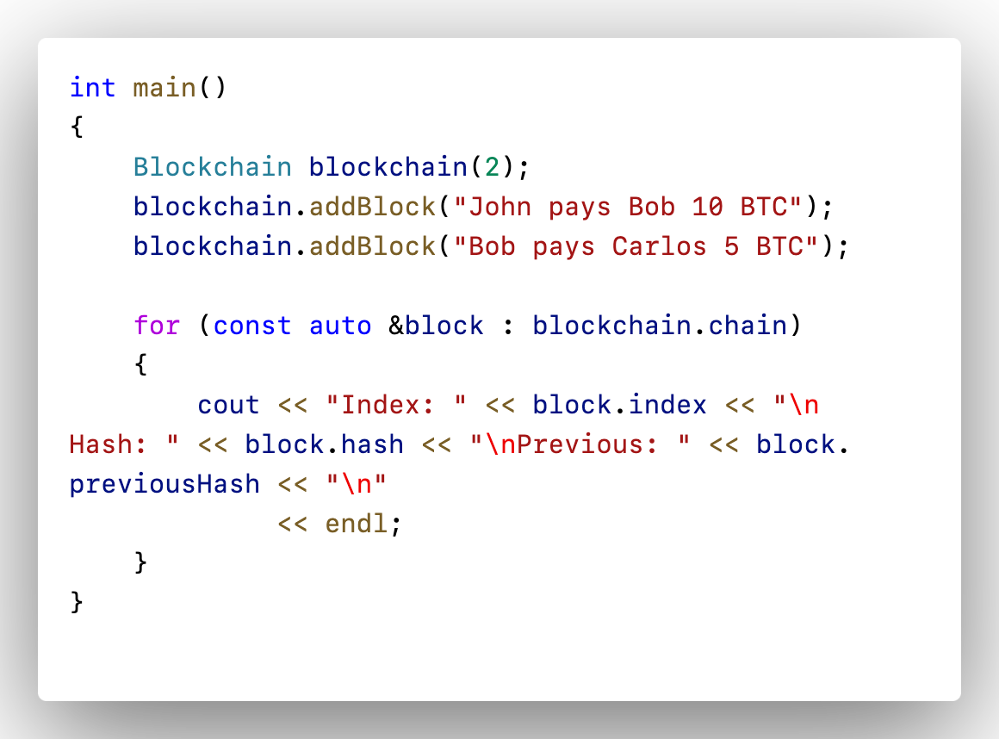
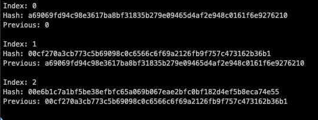

## 🏆 C++ Blockchain Implementation  

This is a simple **Blockchain Implementation in C++**. It includes:  
- Block structure with hash generation  
- Proof-of-work (mining)  
- Adding blocks with transactions  
- Chain validation  

### 📌 Features  
1. **SHA-256 hashing** for security  
2. **Mining (Proof-of-Work)** using nonce and difficulty level  
3. **Genesis block creation**  
4. **Transaction storage**  
5. **Chain integrity validation**  

---

## 🚀 Usage  

### 1️⃣ How to run it:
To run this, you need to install openssl and configure:
```bash
g++ -o block blockchain.cpp -I/opt/homebrew/opt/openssl/include -L/opt/homebrew/opt/openssl/lib -lssl -lcrypto -std=c++11
```

### 2️⃣ Implementation Code :
<!-- | Example Code | Output |
|--------------|--------|
|  |  | -->


| Example Code | Output |
|--------------|--------|
|  |  |


---

## 👨‍💻 Author  
Developed by **[Krisna Pranav]** 🚀  

---