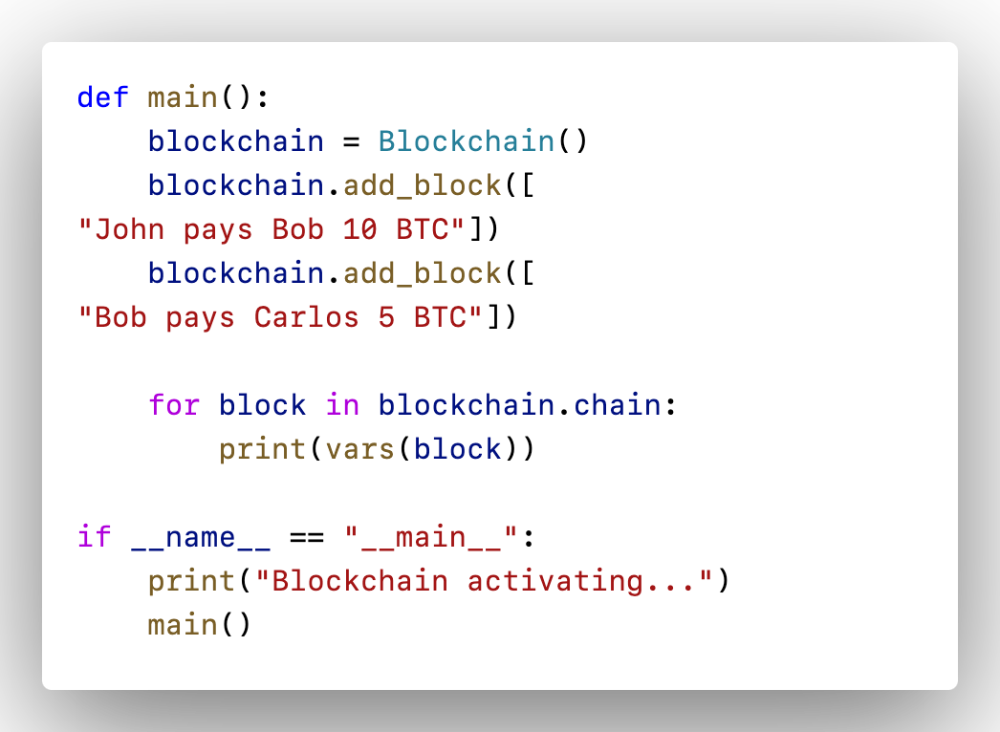

## 🏆 Python Blockchain Implementation  

This is a simple **Blockchain Implementation in Python** 🐍. It includes:  
- Block structure with hash generation  
- Proof-of-work (mining)  
- Adding blocks with transactions  
- Chain validation  

### 📌 Features  
1. **SHA-256 hashing** for security  
2. **Mining (Proof-of-Work)** using nonce and difficulty level  
3. **Genesis block creation**  
4. **Transaction storage**  
5. **Chain integrity validation**  

---

## 🚀 Usage  

### 1️⃣ Install Dependencies  
Python comes with built-in libraries, so no external dependencies are required. Just run the script:  
```bash
python3 blockchain.py
```

### 2️⃣ Example Code:
- Block Structure is shown down
  

---

## 👨‍💻 Author  
Developed by **[Krisna Pranav]** 🚀  

---